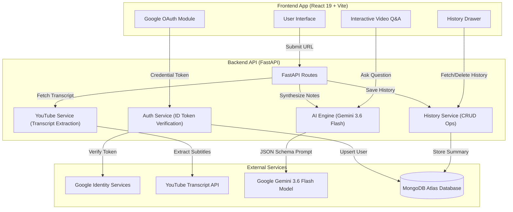

<div align="center">


<<<<<<< HEAD
### *AI Video Intelligence & Automated Note-Taking System*
=======
# TubeLoom AI

### Cinematic Video Intelligence & Automated Note-Taking System
>>>>>>> eb4123f (New ft. addon)


</div>

---

## Overview

TubeLoom AI is a full-stack video intelligence platform designed to extract, analyze, and synthesize YouTube video transcripts into structured executive notes, key topics, actionable takeaways, and interactive Q&A chat.

The application combines a high-performance React 19 frontend with a FastAPI serverless-ready backend, powered by Google Gemini 3.6 Flash and MongoDB Atlas. It includes real-time dark/light theme switching with adaptive SVG favicons, Google OAuth authentication, a sliding history drawer, and native browser popstate navigation.

---

## System Architecture



---

## Project Structure

```text
TubeLoom-AI/
├── README.md                      # Project Documentation
├── package.json                   # Root Configuration
├── tubeloom-backend/              # Python FastAPI Application
│   ├── .env                       # Environment Variables (Git-ignored)
│   ├── .env.example               # Backend Environment Template
│   ├── requirements.txt           # Python Package Dependencies
│   ├── main.py                    # API Entrypoint, CORS & Route Registrations
│   ├── auth_service.py            # OAuth ID Token Verification & MongoDB Upsert
│   ├── ai_service.py              # Gemini 3.6 Flash Prompt Synthesis & Q&A RAG
│   ├── youtube_service.py         # YouTube URL Parser & Transcript Extractor
│   ├── history_service.py         # MongoDB History CRUD Operations
│   └── database.py                # Async Motor MongoDB Connection
└── tubeloom-frontend/             # React 19 + Vite Web Application
    ├── vercel.json                # Single-Page Application Rewrite Rules
    ├── package.json               # Frontend Dependencies & Build Scripts
    ├── vite.config.js             # Vite Compiler Options
    ├── index.html                 # Main Entry HTML & Web Font Imports
    ├── public/                    # Static Assets & Dynamic Favicons
    │   ├── favicon.svg            # Media-Query Adaptive SVG Favicon
    │   ├── favicon-dark.svg       # Dark Theme Favicon
    │   └── favicon-light.svg      # Light Theme Favicon
    └── src/
        ├── main.jsx               # React Mount Point & GoogleOAuthProvider
        ├── App.jsx                # Application Root Component & Routing State
        ├── App.scss               # Main Layout Grid & Animations
        ├── index.css              # Design Tokens & CSS Reset
        ├── components/
        │   ├── Header.jsx         # Navigation Header & Brand Control
        │   ├── Header.scss        # Header Action Layout
        │   ├── Auth.jsx           # Google Sign-In & Profile Menu
        │   ├── Auth.scss          # Profile Avatar & Menu Styles
        │   ├── HistorySidebar.jsx # Sliding Drawer & History Item Cards
        │   ├── HistorySidebar.scss# Glassmorphism Drawer & Shimmer Skeletons
        │   ├── UrlForm.jsx        # YouTube URL Submission Form
        │   ├── UrlForm.scss       # Submission Form Styles
        │   ├── LandingFeatures.jsx# Value Proposition Feature Showcase
        │   ├── LandingFeatures.scss# Feature Grid Layout
        │   ├── VideoPlayer.jsx    # Responsive YouTube Video Embed
        │   ├── VideoPlayer.scss   # Video Container Aspect Ratio & Glow
        │   ├── SummaryPanel.jsx   # Executive Summary & Takeaways List
        │   ├── SummaryPanel.scss  # Summary Typography & Spacing
        │   ├── ChatPanel.jsx      # Video Q&A Interactive Panel
        │   ├── ChatPanel.scss     # Chat Bubbles & Loading State
        │   ├── FormattedText.jsx  # Markdown and Text Formatting Renderer
        │   └── FormattedText.scss # Formatted Text Styles
        └── services/
            ├── api.js             # Axios API Service for Summaries & History
            └── authService.js     # Auth API Client & Local Session Management
```

---

## Data Models (MongoDB Atlas)

Database Name: `tubeloom_db`

### 1. `user` Collection
Stores user account profiles authenticated via Google OAuth.

```json
{
  "_id": ObjectId("66c5a1e2f..."),
  "google_id": "1098234790123847192",
  "email": "user@gmail.com",
  "name": "Jane Doe",
  "picture": "https://lh3.googleusercontent.com/a/...",
  "last_login": ISODate("2026-08-20T21:00:00Z")
}
```

### 2. `history` Collection
Stores summary entries linked to registered user accounts.

```json
{
  "_id": ObjectId("66c5a2f8e..."),
  "google_id": "1098234790123847192",
  "video_url": "https://www.youtube.com/watch?v=dQw4w9WgXcQ",
  "video_id": "dQw4w9WgXcQ",
  "title": "Executive Summary Title",
  "executive_summary": "Structured summary of the video transcript...",
  "created_at": ISODate("2026-08-20T21:05:00Z")
}
```

---

## Core Capabilities

- **Automated Summarization**: Extracts transcripts via `youtube-transcript-api` and generates structured executive notes using Gemini 3.6 Flash.
- **Context-Grounded Q&A**: Answers questions about the video content based strictly on transcript data.
- **Google OAuth Authentication**: Secure Google single sign-on with token verification and persistent local user session management.
- **Personalized History Sidebar**: Sliding drawer displaying user history cards with video thumbnails, creation dates, quick item loading, and deletion.
- **Dynamic Theme & Adaptive Favicons**: Dark/Light mode support with View Transitions API and real-time SVG favicon switching.
- **Mobile-First Layout**: Fully responsive CSS Grid and Flexbox layouts optimized for mobile, tablet, and desktop viewports.
- **Browser History Integration**: Integrated `popstate` browser back-button routing to return to the landing view smoothly.

---

## Environment Configuration

### Frontend (`tubeloom-frontend/.env`)
```env
VITE_GOOGLE_CLIENT_ID=590817430302-pcvcv894r707rofceie251pphkh5ev6e.apps.googleusercontent.com
VITE_API_BASE_URL=http://127.0.0.1:8000
```

### Backend (`tubeloom-backend/.env`)
```env
GEMINI_API_KEY=your_gemini_api_key_here
GOOGLE_CLIENT_ID=590817430302-pcvcv894r707rofceie251pphkh5ev6e.apps.googleusercontent.com
MONGO_URI=mongodb+srv://<username>:<password>@cluster.mongodb.net/
```

---

## Local Development Setup

### 1. Prerequisites
- **Node.js**: v18.0 or higher
- **Python**: v3.10 or higher
- **MongoDB Atlas Cluster**

### 2. Backend Setup
```bash
# Change directory to backend
cd tubeloom-backend

# Create virtual environment
python -m venv venv

# Activate virtual environment
# Windows:
.\venv\Scripts\activate
# macOS/Linux:
source venv/bin/activate

# Install required dependencies
pip install -r requirements.txt

# Start FastAPI development server
uvicorn main:app --reload --port 8000
```

### 3. Frontend Setup
```bash
# Change directory to frontend
cd tubeloom-frontend

# Install dependencies
npm install

# Start Vite development server
npm run dev
```

Open `http://localhost:5173` in your browser.

---

## Deployment Instructions

### Deploying Frontend to Vercel
1. Import the repository into Vercel and select the root directory `tubeloom-frontend`.
2. Configure Environment Variables:
   - `VITE_GOOGLE_CLIENT_ID`: Your Google OAuth Client ID
   - `VITE_API_BASE_URL`: Your live backend API URL
3. Add your custom domain under **Project Settings** -> **Domains**.
4. Register your domain under **Authorized JavaScript Origins** in Google Cloud Console.

### Deploying Backend to Render / Railway
1. Create a new Web Service pointing to `tubeloom-backend`.
2. Build Command: `pip install -r requirements.txt`
3. Start Command: `uvicorn main:app --host 0.0.0.0 --port $PORT`
4. Configure Environment Variables (`GEMINI_API_KEY`, `GOOGLE_CLIENT_ID`, `MONGO_URI`).

---

<div align="center">

<<<<<<< HEAD
Crafted with precision for **TubeLoom AI By Vineet Dwivedi** 
=======
Developed for **TubeLoom AI**
>>>>>>> eb4123f (New ft. addon)

</div>
