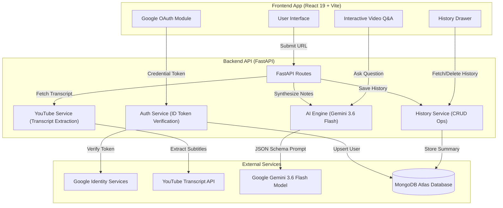

<div align="center">

# 🎬 TubeLoom AI

### *Cinematic Video Intelligence & Automated Note-Taking System*


</div>

---

## 📌 Overview

**TubeLoom AI** is a full-stack, AI-powered video intelligence workspace. It transforms long YouTube videos into structured executive summaries, key topics, actionable takeaways, and interactive Q&A chat in real time.

Built with **React 19**, **Vite**, **FastAPI**, **Google Gemini 3.6 Flash**, and **MongoDB Atlas**, TubeLoom AI features a dark/light design system with view transitions, Google OAuth single sign-on, a sliding history drawer with thumbnail previews, and browser back-button routing.

---

## 📐 System Architecture



---

## 📂 File Directory Structure

```text
TubeLoom-AI/
├── README.md                      # Complete System Documentation
├── package.json                   # Workspace Root Config
├── tubeloom-backend/              # FastAPI Python Backend
│   ├── .env                       # Backend Environment Variables
│   ├── .env.example               # Backend Environment Template
│   ├── requirements.txt           # Python Package Dependencies
│   ├── main.py                    # FastAPI App Entrypoint & Middleware
│   ├── auth_service.py            # Google OAuth ID Token Verification & User Upsert
│   ├── ai_service.py              # Gemini 3.6 Flash Summarization & Chat RAG
│   ├── youtube_service.py         # YouTube Video ID Parser & Transcript Fetcher
│   ├── history_service.py         # MongoDB History CRUD Service
│   └── database.py                # Async Motor MongoDB Client & Collections
└── tubeloom-frontend/             # React 19 + Vite Frontend
    ├── vercel.json                # Vercel SPA Routing Rewrite Config
    ├── package.json               # Frontend Dependencies & Scripts
    ├── vite.config.js             # Vite Build Settings
    ├── index.html                 # Main HTML Template & Fonts
    ├── public/                    # Static Assets & Dynamic Favicons
    │   ├── favicon.svg            # Media-Query Adaptive SVG Favicon
    │   ├── favicon-dark.svg       # Dark Mode Tab Favicon
    │   └── favicon-light.svg      # Light Mode Tab Favicon
    └── src/
        ├── main.jsx               # React Mount Point & GoogleOAuthProvider
        ├── App.jsx                # Core App Component & Routing State
        ├── App.scss               # Main Layout Grid & Animations
        ├── index.css              # Design Tokens & CSS Reset
        ├── components/
        │   ├── Header.jsx         # Header Navigation & Brand Logo
        │   ├── Header.scss        # Header Action Layout
        │   ├── Auth.jsx           # Google Login & Profile Dropdown
        │   ├── Auth.scss          # Profile Avatar & Dropdown Styles
        │   ├── HistorySidebar.jsx # Sliding Drawer & History List Cards
        │   ├── HistorySidebar.scss# Glassmorphism Drawer & Shimmer Skeletons
        │   ├── UrlForm.jsx        # YouTube URL Input Form
        │   ├── UrlForm.scss       # Input Form Styles
        │   ├── LandingFeatures.jsx# Value Proposition Feature Showcase
        │   ├── LandingFeatures.scss# Feature Grid Styles
        │   ├── VideoPlayer.jsx    # Responsive Embedded YouTube Player
        │   ├── VideoPlayer.scss   # 16:9 Aspect Ratio Frame & Glow
        │   ├── SummaryPanel.jsx   # Executive Summary & Takeaways List
        │   ├── SummaryPanel.scss  # Summary Card Typography
        │   ├── ChatPanel.jsx      # Video Q&A Chat Section
        │   ├── ChatPanel.scss     # Chat Bubbles & Shimmer Loading Bar
        │   ├── FormattedText.jsx  # Markdown / Bullet Renderer
        │   └── FormattedText.scss # Text Formatting Styles
        └── services/
            ├── api.js             # Axios API Client for Processing & History
            └── authService.js     # Auth API Client & Local Storage Session
```

---

## 🗄️ Database Schemas (MongoDB Atlas)

Database Name: `tubeloom_db`

### 1. `user` Collection
Stores user profiles authenticated via Google OAuth.

```json
{
  "_id": ObjectId("66c5a1e2f..."),
  "google_id": "1098234790123847192",
  "email": "user@gmail.com",
  "name": "Jane Doe",
  "picture": "https://lh3.googleusercontent.com/a/...",
  "last_login": ISODate("2026-08-20T21:00:00Z")
}
```

### 2. `history` Collection
Stores video summaries linked to registered users.

```json
{
  "_id": ObjectId("66c5a2f8e..."),
  "google_id": "1098234790123847192",
  "video_url": "https://www.youtube.com/watch?v=dQw4w9WgXcQ",
  "video_id": "dQw4w9WgXcQ",
  "title": "Executive Summary Title",
  "executive_summary": "Comprehensive 2-sentence summary of the video content...",
  "created_at": ISODate("2026-08-20T21:05:00Z")
}
```

---

## ✨ Key Features

- ⚡ **Instant AI Summarization**: Extracts YouTube transcripts and generates structured executive notes using Gemini 3.6 Flash.
- 💬 **Context-Aware Video Q&A**: Ask any question about the video and get precise answers grounded strictly in transcript context.
- 🔐 **Google Single Sign-On**: Seamless OAuth authentication with local session persistence and user avatar dropdown menu.
- 📜 **Personalized History Sidebar**: Sliding drawer listing previously summarized videos with thumbnails, creation timestamps, instant reload, and item deletion.
- 🌓 **Dynamic Design & Favicon**: Dark/Light mode with View Transitions API and real-time SVG favicon switching.
- 📱 **Mobile-First Responsiveness**: Tailored layout for mobile, tablet, and desktop viewports.
- 🔄 **Browser History Navigation**: Full `popstate` browser back-button routing to navigate back to the home view effortlessly.

---

## 🔑 Environment Variables

### Frontend (`tubeloom-frontend/.env`)
```env
VITE_GOOGLE_CLIENT_ID=590817430302-pcvcv894r707rofceie251pphkh5ev6e.apps.googleusercontent.com
VITE_API_BASE_URL=http://127.0.0.1:8000
```

### Backend (`tubeloom-backend/.env`)
```env
GEMINI_API_KEY=your_gemini_api_key_here
GOOGLE_CLIENT_ID=590817430302-pcvcv894r707rofceie251pphkh5ev6e.apps.googleusercontent.com
MONGO_URI=mongodb+srv://<username>:<password>@cluster.mongodb.net/
```

---

## 🚀 Getting Started

### 1. Prerequisites
- **Node.js**: v18.0 or higher
- **Python**: v3.10 or higher
- **MongoDB Atlas Account**

### 2. Backend Setup
```bash
# Navigate to backend directory
cd tubeloom-backend

# Create virtual environment
python -m venv venv

# Activate virtual environment
# Windows:
.\venv\Scripts\activate
# macOS/Linux:
source venv/bin/activate

# Install dependencies
pip install -r requirements.txt

# Start FastAPI development server
uvicorn main:app --reload --port 8000
```

### 3. Frontend Setup
```bash
# Navigate to frontend directory
cd tubeloom-frontend

# Install dependencies
npm install

# Start Vite development server
npm run dev
```

Open `http://localhost:5173` in your browser.

---

## 🌐 Deployment Guide

### Deploying Frontend to Vercel
1. Import repository to Vercel and select root directory `tubeloom-frontend`.
2. Add Environment Variables:
   - `VITE_GOOGLE_CLIENT_ID`: Your Google OAuth Client ID
   - `VITE_API_BASE_URL`: Your deployed FastAPI backend URL
3. Add Custom Domain in Project Settings -> Domains.
4. Add custom domain URL to **Authorized JavaScript Origins** in Google Cloud Console.

### Deploying Backend to Render / Railway
1. Create Web Service pointing to `tubeloom-backend`.
2. Build Command: `pip install -r requirements.txt`.
3. Start Command: `uvicorn main:app --host 0.0.0.0 --port $PORT`.
4. Configure Environment Variables (`GEMINI_API_KEY`, `GOOGLE_CLIENT_ID`, `MONGO_URI`).

---

<div align="center">

Crafted with precision for **TubeLoom AI By Vineet Dwivedi** 

</div>
